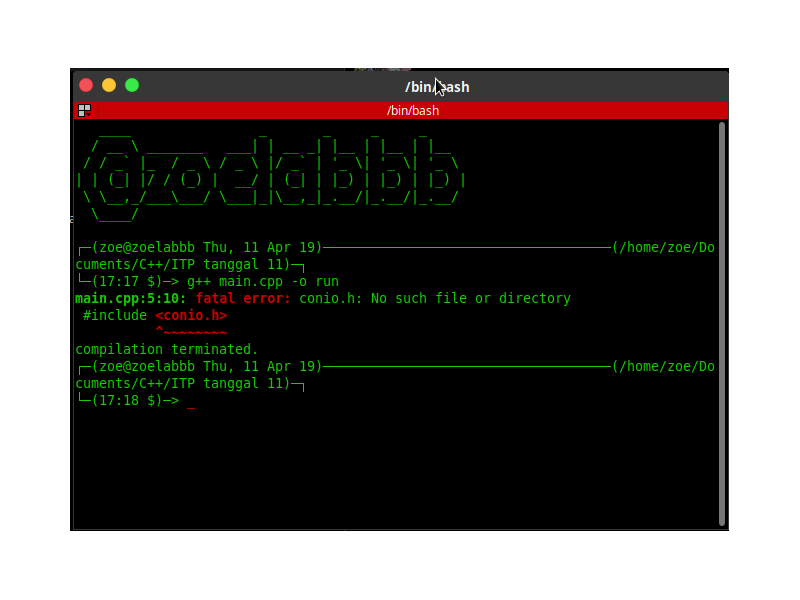

# Library <conio.h> For Linux

## What is `#include <conio.h>`

If you see at the top of some C/C++ code, 90% of the time you'll see the line `#include <conio.h>`.  
But unfortunately it's only for Windows.

The `<conio.h>` header file contains certain library functions that peform and formatting input and output operation.  
`conio` stands for console-input-output and ".h" is basically header file extension.

If you try to include it on Linux am error will be shown, like below:


# List Function <conio.h>
```
  cprintf
  cscanf
  gotoxy
  clrscr
  textcolor
  textbackground
  wherex
  wherey
  getch
  getche
  ungetch
  kbhit
  putch
  putchar
  cputs
  clreol
  insline (not implemented)
  delline (not implemented)
  cgets   (not implemented)
  getpass (not implemented)
  gettext (not implemented)
  _cprintf
  _cscanf
  _cputs
  _getche
  _kbhit
  _putch
  _ungetch
```

Some of it's functions which are often used:
- `kbhit` - Determines if a keyboard key was pressed;
- `gcgets` - Reads a string directly from the console;
- `cscanf` - Reads formatted values directly from the console;
- `putch` - Writes a character directly to the console;
- `cputs` - Writes a string directly to the console;
- `cprintf` - Formats values and writes them directly to the console;
- `clrscr` - Clears the screen; and
- `getch` - Get char entry from the console.

# How To Install The Library
- Clone this repo as you prefer.
  - `git clone https://github.com/zoelabbb/conio.h`
  - `gh repo clone zoelabbb/conio.h`
- `cd conio.h`
- Install the GNU Make.
  - `sudo apt update -y`
  - `sudo apt upgrade -y`
  - `sudo apt install -y make`
- `make install`

Now just be happy :D

# Support Us

Wanna Support us? You can buy us some coffee via:
- [PayPal :coffee:](https://www.paypal.com/paypalme/haialipp);
- [Buy Coffee for ikoo :coffee:](https://www.buymeacoffee.com/ikoo); and
- [Buy Coffee for Panda :coffee:](https://www.buymeacoffee.com/pandasoliofc).
